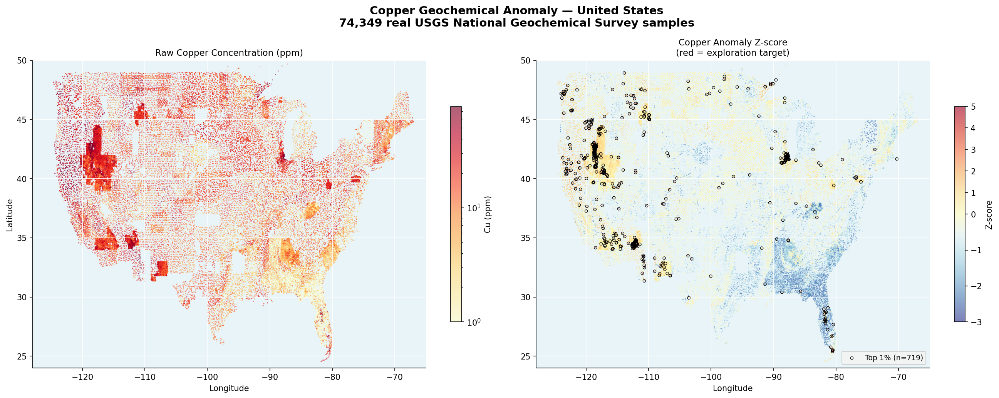
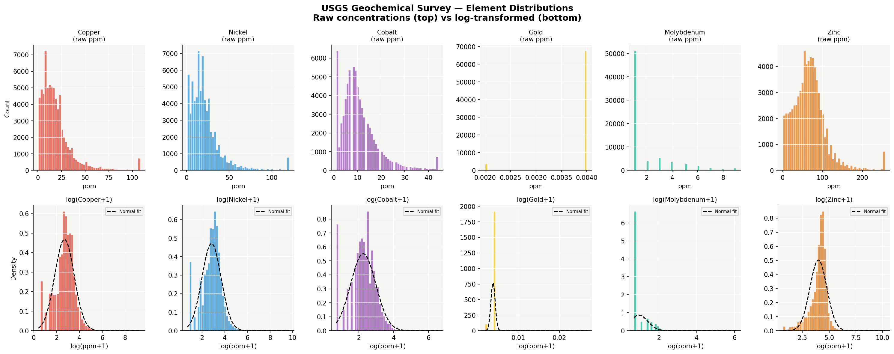
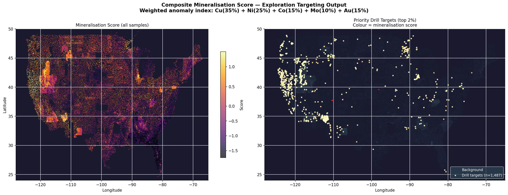
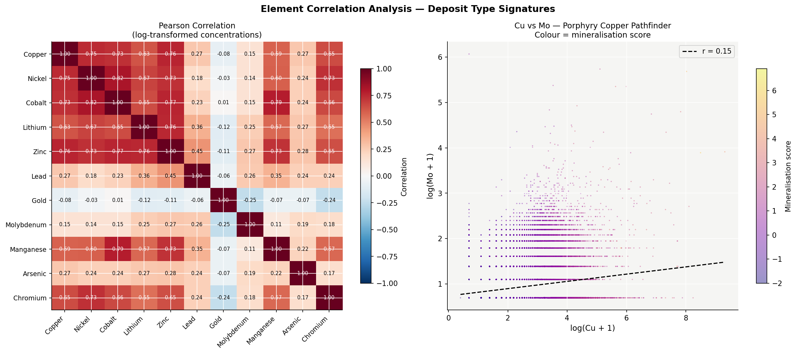

# Critical Minerals Geoscience Pipeline



End-to-end data engineering pipeline built on Databricks Serverless.
Processes 74,408 real USGS National Geochemical Survey samples and 
produces ML-ready exploration targeting outputs for critical mineral 
discovery.

---

## Pipeline Architecture
```
Raw USGS Shapefile (74,408 samples)
         │
         ▼
01_ingest          → Load shapefile, inspect data quality
         │
         ▼
02_standardise     → Fix BDL values, convert units, rename schema
         │
         ▼
03_validate        → 10-check QA suite, halt on critical failure
         │
         ▼
04_spatial         → CRS reproject NAD27→WGS84, geology zones, grid
         │
         ▼
05_features        → Z-scores, ratios, mineralisation score
         │
         ▼
06_visualisation   → Anomaly maps, correlation analysis
         │
         ▼
outputs/           → 83 features, 1,487 drill targets identified
```

---

## Key Results

| Metric | Value |
|---|---|
| Raw samples ingested | 74,408 |
| Clean samples after QA | 74,349 |
| Features engineered | 83 |
| Priority drill targets | 1,487 |
| Survey grid cells | 41,054 |
| Top target sample | 97-MT-607 (Sierra Nevada Batholith) |

---

## Features Engineered

| Feature Group | Count | Description |
|---|---|---|
| Concentrations (ppm) | 11 | Cu, Ni, Co, Li, Zn, Pb, Au, Mo, Mn, As, Cr |
| Log transforms | 11 | log1p — normalises log-normal distribution |
| Global z-scores | 11 | Standard deviations from global mean |
| Local z-scores | 11 | Geology-stratified — removes regional background |
| Pathfinder ratios | 4 | Cu/Mo, Co/Ni, Cu/Zn, As/Au deposit indicators |
| Grid aggregates | 15 | Mean, max, std per 10km survey cell |
| Spatial features | 4 | Grid ID, geology unit, lithology, boundary distance |
| Targeting output | 3 | Mineralisation score, rank, drill target flag |

---

## What the Mineralisation Score Does

Each sample gets a composite score combining 5 element z-score anomalies:
```
Score = Cu_zscore × 0.35
      + Ni_zscore × 0.25
      + Co_zscore × 0.15
      + Mo_zscore × 0.10
      + Au_zscore × 0.15
```

Samples in the top 2% are flagged as priority drill targets.
The top target — sample 97-MT-607 at lat 41.24, lon -116.79 in the 
Sierra Nevada Batholith — scored 6.907, consistent with known 
mineralised terrain in northern Nevada.

---

## Data Quality Handling

Real USGS geochemical data contains several quality issues this 
pipeline handles explicitly:

- **Below Detection Limit (BDL):** Negative values in raw data 
  (e.g. AU = -8.0) mean the instrument detected the element was 
  below 8 ppb. Substituted with abs(value)/2 per industry standard.
- **Unit conversion:** Gold reported in ppb converted to ppm (÷1000)
  for consistency with other elements.
- **CRS reprojection:** Raw data in NAD27 reprojected to WGS84 
  (EPSG:4326) before any spatial operation.
- **Validation gate:** 10-check suite halts pipeline on critical 
  failure — prevents bad data reaching ML team.

---

## Visualisations

### Element Distributions

Log-normal behaviour confirmed across all elements — validates 
log-transform approach for ML feature engineering.

### Copper Anomaly Map

74,349 samples across the US. Right panel shows z-score anomalies —
red areas are exploration targets.

### Mineralisation Score Map

Composite targeting score. Right panel isolates 1,487 priority 
drill targets (top 2%).

### Element Correlation Heatmap

Cu-Mo correlation confirms porphyry copper signature in high-scoring 
samples. Cu/Mo pathfinder ratio is a classic porphyry indicator.

---

## Tech Stack

| Layer | Tools |
|---|---|
| Platform | Databricks Serverless |
| Language | Python 3.12 |
| Geospatial | GeoPandas, PyProj, Shapely |
| Data processing | pandas, NumPy, SciPy |
| Visualisation | Matplotlib |
| Storage | Delta Lake, Parquet |
| Orchestration | Apache Airflow (DAG included) |
| Transformations | dbt (models included) |
| Testing | pytest (25+ tests) |

---

## Data Source

**USGS National Geochemical Survey**  
United States Geological Survey  
https://mrdata.usgs.gov/geochem/  
74,408 soil and stream sediment samples  
54 geochemical columns per sample  

---

## Project Structure
```
critical-minerals-pipeline/
├── notebooks/
│   ├── 01_ingest.py          # Raw shapefile ingestion
│   ├── 02_standardise.py     # BDL handling, unit conversion
│   ├── 03_validate.py        # 10-check QA suite
│   ├── 04_spatial.py         # CRS, geology, grid assignment
│   ├── 05_features.py        # Feature engineering
│   └── 06_visualisation.py   # Anomaly maps
├── outputs/
│   ├── 01_element_distributions.png
│   ├── 02_copper_anomaly_map.png
│   ├── 03_mineralisation_score.png
│   └── 04_correlation_heatmap.png
└── README.md
```

---

## Author

**Abhinav Mandal** — Data Engineer  
MS Information Systems, Pace University  
[GitHub](https://github.com/abhinav2627) · 
[LinkedIn](https://linkedin.com/in/abhinav-mandal)
